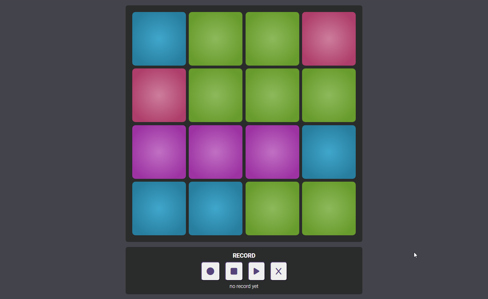

# Drumpad App

## Description

Drumpad App is a simple application that allows you to play drum sounds by clicking on virtual pads. It provides a fun and interactive way to create beats and experiment with different drum sounds.

## Features

- Click on the virtual pads to play drum sounds.
- Register your drums sequences. 
- Play your track.
- Responsive design that works well on different devices.
- Realistic drum sounds for an immersive experience.
- Intuitive user interface for easy navigation.

## Technology

  
 
  
  

## Demo

To see a live demo of the Drumpad App, visit [Demo](https://www.massidev.com/portfolio/drumpad/).

## Installation

To run the Drumpad app locally, follow these steps:

1. Clone the repository: `git clone https://github.com/massi-17/drumpad-app.git`
2. Navigate to the project directory: `cd drumpad-app`
3. Open the `index.html` file in your preferred web browser.

## Contributing

Contributions are welcome! If you want to contribute to this Drumpad app, please follow these steps:

1. Fork the repository.
2. Create a new branch: `git checkout -b feature/your-feature`.
3. Make your changes and commit them: `git commit -m 'Add your feature'`.
4. Push to the branch: `git push origin feature/your-feature`.
5. Submit a pull request.

